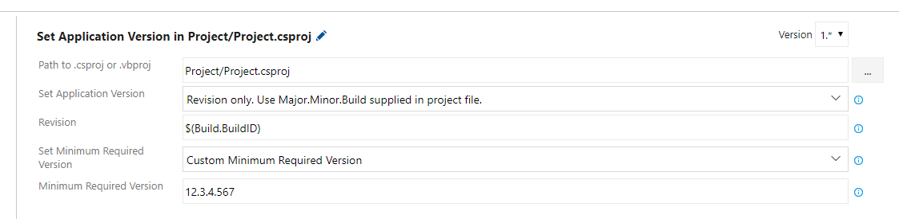

## Project Version Tools ##

### Set Project Version ###

Update a project's Application Version and/or Minimum Required Version.

#### Application Version ####

There are three options available for updating the `Application Version`:

1. **Do not update Application Version** - Application Version will not be updated, will use the value supplied in the project file.
2. **Revision only** - The Major.Minor.Build numbers will be supplied by the project file. Only the revision number will be changed. This will be user-supplied in a text field, and can be a variable.
3. **Custom Application Version** - Set a completely custom Application Version number. Can be a variable or set of variables.

#### Minimum Required Version ####

There are three options available for updating the `Minimum Required Version`:

1. **Do not update Minimum Required Version** - Minimum Required Version will not be updated, will use the value supplied in the project file.
2. **Same as Application Version** - Sets Minimum Application Version to the same value as the Application Version, even if the Application Version is not updated.
3. **Custom Minimum Required Version** - Set a completely custom Minimum Required Version number. Can be a variable or set of variables.



### Get Application Version as Variables ###

Reads the project file and creates variables from the Application Version, available in a number of formats:

```
Version.Major
Version.Minor
Version.Build
Version.Patch (same as Version.Build)
Version.Revision
Version.MajorMinor
Version.MajorMinorBuild
Version.MajorMinorPatch
Version.MajorMinorBuildRevision
Version.MajorMinorPatchRevision
Version.Full (same as Version.MajorMinorBuildRevision)
```

An optional prefix can be set so that the task can be used on multiple projects. If the prefix is set to `Fabrikam` then the Application Version variable can be added to another task as `$(Fabrikam.Version.Full)`.

